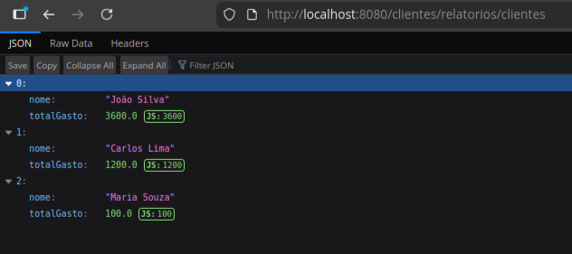
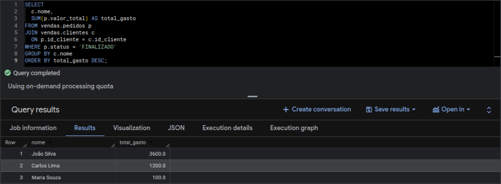
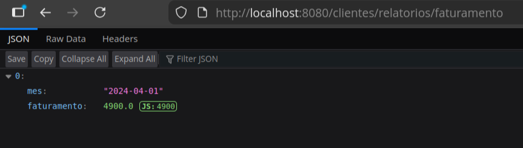
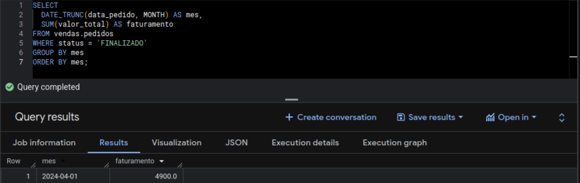

# Projeto Simulador de Vendas Java, SQL e BigQuery

Neste projeto eu implementei SQL básico tanto em PostgreSQL quanto em BigQuery, com o objetivo de comparar abordagens diferentes que acabam chegando no mesmo resultado.

---

## Sobre o projeto

Ele foi criado com o intuito de me introduzir no mundo de bancos de dados e análise de dados.

Atualmente o sistema simula uma base de vendas simples, onde é possível:

- gerar ranking de clientes com base no valor total gasto  
- calcular o faturamento por mês  
- consultar e estruturar dados de pedidos  

A ideia principal foi entender na prática como um mesmo problema pode ser resolvido tanto em um banco relacional tradicional quanto em um ambiente de análise em nuvem.

---

## Objetivo

- dar aquela praticada em SQL
- entender consultas analíticas  
- comparar PostgreSQL com BigQuery  
- estruturar um backend simples em Java  
- simular um cenário próximo de um sistema real de vendas  

---

## Tecnologias utilizadas

- Java  
- Spring Boot  
- PostgreSQL  
- BigQuery  
- Maven  
- SQL  

---

## Arquitetura do projeto

O projeto segue uma arquitetura simples em camadas:

- Controller → responsável pelas requisições HTTP  
- Service → regras de negócio  
- Repository → acesso ao banco de dados  
- DTO → estrutura de retorno dos dados  

---

## Funcionalidades implementadas

- Ranking de clientes por valor total gasto  
- Cálculo de faturamento mensal  
- Consultas SQL com agregações e joins  
- Integração com PostgreSQL e BigQuery  
- Validação de consistência entre os dois ambientes  

---

## Observação importante

O mesmo conjunto de dados e consultas foi executado em dois ambientes diferentes:

- PostgreSQL (ambiente local)  
- BigQuery (ambiente em nuvem)  

Isso permitiu comparar sintaxe, performance e comportamento das consultas.

---

## Dados utilizados

[clientes](https://github.com/user-attachments/files/26799921/clientes_202604160557.csv)

[itens_pedido](https://github.com/user-attachments/files/26799933/itens_pedido_202604160557.csv)

[pedidos](https://github.com/user-attachments/files/26799955/pedidos_202604160557.csv)

[produtos](https://github.com/user-attachments/files/26799948/produtos_202604160557.csv)

---

## Resultados

As imagens abaixo representam o retorno da implementação do sistema que classifica os clientes de acordo com o valor gasto na empresa.

***Local:***

***BigQuery:***

As próximas imagens sao do sistema que calcula o faturamento mensal da empresa 

***Local:***

***BigQuery:***

Nelas podemos perceber que o retorno foi o mesmo, logo, assumimos que a implementacao de ambas está correta.

---
